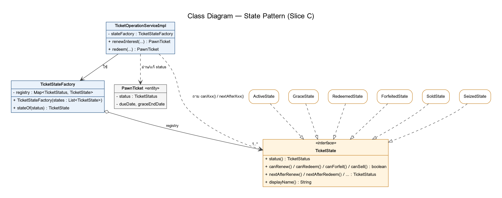
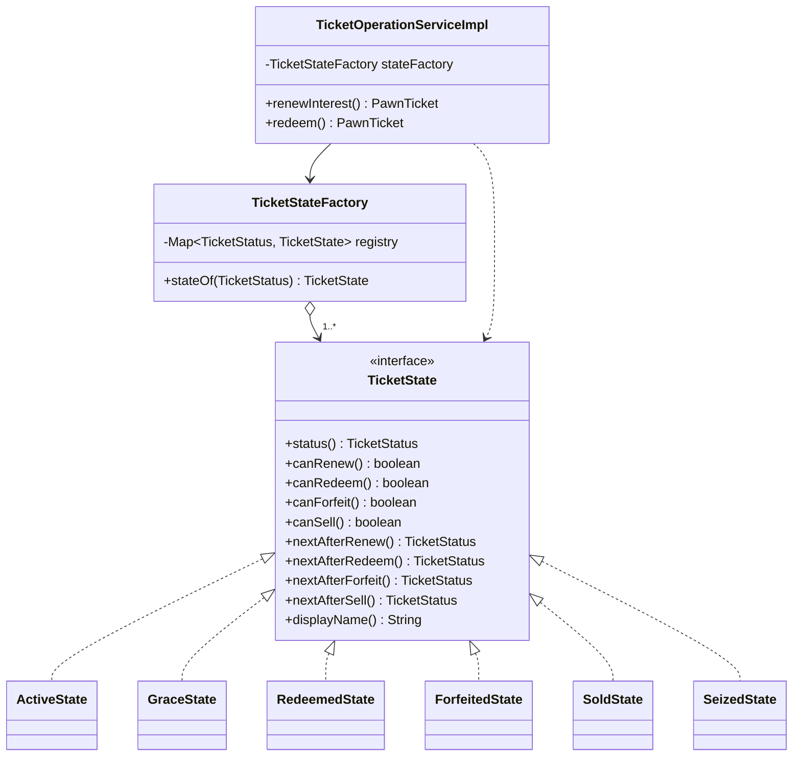

# Design Patterns

path ทั้งหมดเริ่มจาก `code/pawnshop/src/main/java/com/kku/pawnshop/`

> แต่ละคนเขียนเฉพาะแถว / หัวข้อของ pattern ที่ตัวเองรับผิดชอบ

---

## 1. Enterprise / Architectural Patterns

| Pattern | ปัญหาที่แก้ | ไฟล์ / คลาสที่ใช้ |
|---|---|---|
| Layered Architecture | แยกหน้าที่เป็นชั้น ห้ามข้ามชั้น เปลี่ยนชั้นหนึ่งไม่กระทบชั้นอื่น | `controller/` → `service/` → `repository/` → `domain/` |
| MVC | แยกการแสดงผลออกจาก logic | Controller: `controller/web/TicketWebController` · Model: `TicketResponse` · View: `templates/pawn-tickets/*.html` |
| Repository Pattern | ซ่อนรายละเอียดการเข้าถึงฐานข้อมูล ไม่ต้องเขียน SQL เอง | `repository/PawnTicketRepository` (Spring สร้าง query จากชื่อเมธอด เช่น `findByStatusAndDueDateBefore`) |
| Service Layer Pattern | รวม business logic + transaction ไว้ที่เดียว ทั้ง REST และหน้าเว็บใช้ร่วมกัน ไม่เขียน logic ซ้ำ | `service/impl/TicketOperationServiceImpl` ถูกเรียกจากทั้ง `TicketRestController` และ `TicketWebController` |
| DTO Pattern + Mapper | ไม่ส่ง Entity ออกไปตรง ๆ กัน `LazyInitializationException` และแยกสัญญาของ API จากโครงสร้างตาราง | `dto/request/OpenTicketRequest`, `dto/response/TicketResponse`, `mapper/TicketMapper` |
| Dependency Injection | ไม่ `new` dependency เอง Spring ส่งให้ผ่าน constructor ทำให้เทสด้วย mock ได้ | constructor ของ `TicketOperationServiceImpl`, `TicketRestController` |

_(slice อื่นเพิ่มตัวอย่างไฟล์ของตัวเองในตารางนี้ได้)_

---

## 2. GoF Patterns — กลุ่ม Behavioral

| Pattern | ปัญหาที่แก้ | ไฟล์ / คลาสที่ใช้ | ผู้รับผิดชอบ |
|---|---|---|---|
| **State** | ตั๋วมี 6 สถานะ แต่ละสถานะทำธุรกรรมได้ต่างกัน ถ้าใช้ if-else ต้องเช็คสถานะซ้ำทุกจุด และเพิ่มสถานะ (เช่น อายัด) ต้องไล่แก้ทุกที่ | `domain/state/TicketState`, `ActiveState`, `GraceState`, `RedeemedState`, `ForfeitedState`, `SoldState`, `SeizedState`, `TicketStateFactory` | รัชนาท |
| **Strategy** | ทอง / เครื่องใช้ไฟฟ้า / เครื่องประดับ ตีราคาคนละสูตร | `service/appraisal/AppraisalStrategy` + 3 implementation | นันทกร (รอเติมรายละเอียด) |
| **Observer** | แจ้งเตือนเมื่อไถ่ถอน / หลุดจำนำ โดย service ไม่ต้องรู้จักตัวส่งแจ้งเตือน | publish: `TicketOperationServiceImpl` บรรทัด 186, `TicketAdminServiceImpl` บรรทัด 96 · listener: (ของอนุชา) | อนุชา (รอเติมฝั่ง listener) |

---

## 3. State Pattern — รายละเอียด (Slice C)

### ปัญหา

ตั๋วจำนำมีสถานะ ACTIVE, GRACE, REDEEMED, FORFEITED, SOLD, SEIZED แต่ละสถานะทำธุรกรรมได้ไม่เหมือนกัน เช่น ตั๋วหลุดจำนำไถ่ถอนไม่ได้แต่ขายได้ ถ้าเขียนแบบ if-else

```java
if (status == ACTIVE || status == GRACE) { ... }   // ต้องเขียนแบบนี้ทุกธุรกรรม
```

พอเพิ่มสถานะ SEIZED (อายัด) ซึ่งแทรกเข้ามาได้จากทั้ง ACTIVE และ GRACE แล้วปิดทุกความสามารถ ต้องไล่แก้เงื่อนไขทุกจุด

### วิธีแก้

แต่ละสถานะเป็นคลาสที่ implement `TicketState` และตอบเองว่า "ทำอะไรได้" (`canXxx()`) กับ "ทำแล้วไปสถานะไหน" (`nextAfterXxx()`) Service แค่ถาม state ไม่ต้องรู้ว่าตอนนี้สถานะอะไร

```java
// TicketOperationServiceImpl.java บรรทัด 169–181
TicketState state = stateFactory.stateOf(ticket.getStatus());
if (!state.canRedeem()) {
    throw new InvalidTicketOperationException(...);
}
...
ticket.setStatus(state.nextAfterRedeem());
```

`TicketStateFactory` แปลง `TicketStatus` (enum ที่เก็บในฐานข้อมูล) เป็น state object โดยไม่มี switch — Spring ฉีด state ทุกตัวเป็น `List` แล้วสร้าง map จาก `status()` ของแต่ละตัว

### Class Diagram





### ผลที่ได้

- เพิ่มสถานะใหม่ = เพิ่มคลาส 1 ไฟล์ ไม่แก้ service หรือ factory (OCP)
- state ทุกตัวไม่ throw exception แทนกันได้ (LSP) — การปฏิเสธเป็นหน้าที่ของ service
- หน้าเว็บซ่อนปุ่มที่ทำไม่ได้จาก `canRenew` / `canRedeem` ใน `TicketResponse` (`mapper/TicketMapper.java` บรรทัด 41) ไม่ต้องเขียนกฎสถานะซ้ำใน HTML

### เทสที่ยืนยัน

- `TicketStateTest` 7 เทส — พฤติกรรมของแต่ละสถานะ
- `TicketStateFactoryTest` 3 เทส — factory จ่าย state ครบทุกสถานะ และพังทันทีถ้าขาด

ดูภาพรวมสถานะทั้งหมดได้ที่ [State Diagram](diagrams/ticket-state-diagram.png)
