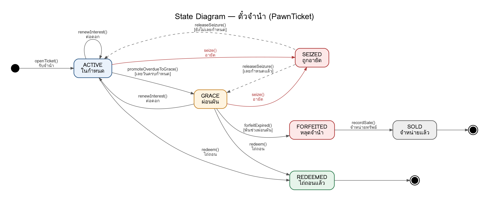
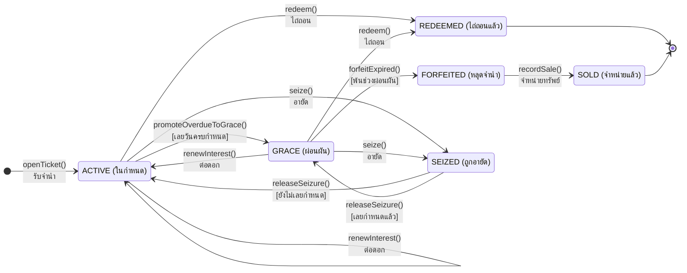
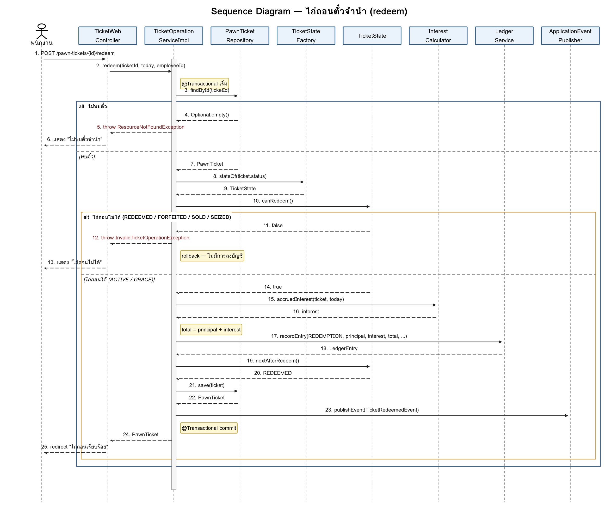
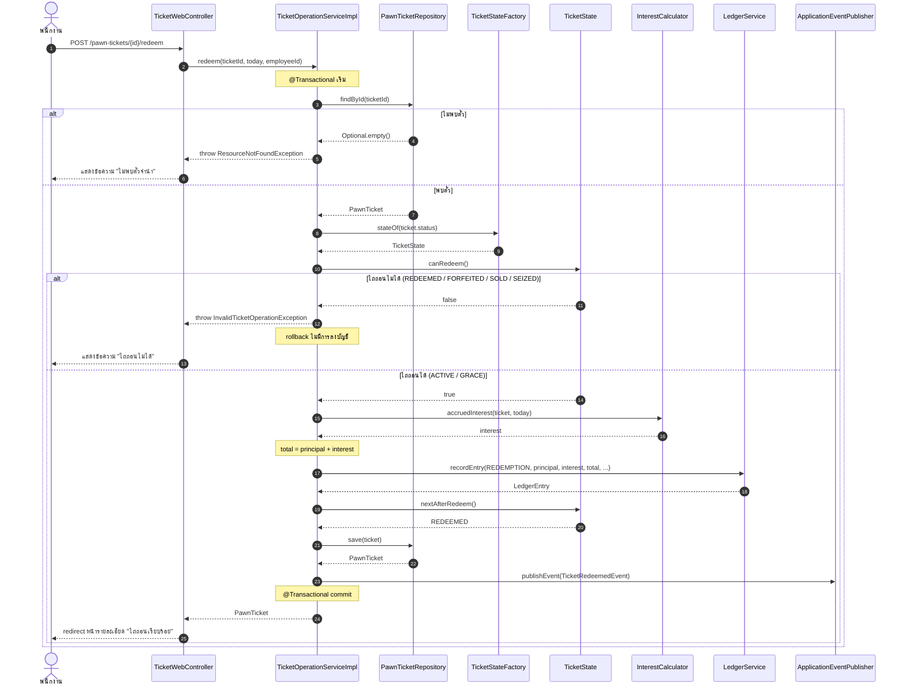

# Slice C Diagrams

## State Diagram — ตั๋วจำนำ

```mermaid
stateDiagram-v2
    direction LR
    [*] --> ACTIVE : openTicket()<br/>รับจำนำ

    ACTIVE --> ACTIVE : renewInterest()<br/>ต่อดอก
    ACTIVE --> REDEEMED : redeem()<br/>ไถ่ถอน
    ACTIVE --> GRACE : promoteOverdueToGrace()<br/>[เลยวันครบกำหนด]

    GRACE --> ACTIVE : renewInterest()<br/>ต่อดอก
    GRACE --> REDEEMED : redeem()<br/>ไถ่ถอน
    GRACE --> FORFEITED : forfeitExpired()<br/>[พ้นช่วงผ่อนผัน]

    ACTIVE --> SEIZED : seize()<br/>อายัด
    GRACE --> SEIZED : seize()<br/>อายัด
    SEIZED --> ACTIVE : releaseSeizure()<br/>[ยังไม่เลยกำหนด]
    SEIZED --> GRACE : releaseSeizure()<br/>[เลยกำหนดแล้ว]

    FORFEITED --> SOLD : recordSale()<br/>จำหน่ายทรัพย์

    REDEEMED --> [*]
    SOLD --> [*]

    ACTIVE : ACTIVE (ในกำหนด)
    GRACE : GRACE (ผ่อนผัน)
    SEIZED : SEIZED (ถูกอายัด)
    FORFEITED : FORFEITED (หลุดจำนำ)
    REDEEMED : REDEEMED (ไถ่ถอนแล้ว)
    SOLD : SOLD (จำหน่ายแล้ว)
```

## Sequence Diagram — ไถ่ถอน

```mermaid
sequenceDiagram
    autonumber
    actor Staff as พนักงาน
    participant C as TicketWebController
    participant S as TicketOperationServiceImpl
    participant R as PawnTicketRepository
    participant F as TicketStateFactory
    participant St as TicketState
    participant IC as InterestCalculator
    participant L as LedgerService
    participant E as ApplicationEventPublisher

    Staff->>C: POST /pawn-tickets/{id}/redeem
    C->>S: redeem(ticketId, today, employeeId)
    Note over S: @Transactional เริ่ม
    S->>R: findById(ticketId)
    alt ไม่พบตั๋ว
        R-->>S: Optional.empty()
        S-->>C: throw ResourceNotFoundException
        C-->>Staff: แสดงข้อความ "ไม่พบตั๋วจำนำ"
    else พบตั๋ว
        R-->>S: PawnTicket
        S->>F: stateOf(ticket.status)
        F-->>S: TicketState
        S->>St: canRedeem()
        alt ไถ่ถอนไม่ได้ (REDEEMED / FORFEITED / SOLD / SEIZED)
            St-->>S: false
            S-->>C: throw InvalidTicketOperationException
            Note over S: rollback ไม่มีการลงบัญชี
            C-->>Staff: แสดงข้อความ "ไถ่ถอนไม่ได้"
        else ไถ่ถอนได้ (ACTIVE / GRACE)
            St-->>S: true
            S->>IC: accruedInterest(ticket, today)
            IC-->>S: interest
            Note over S: total = principal + interest
            S->>L: recordEntry(REDEMPTION, principal, interest, total, ...)
            L-->>S: LedgerEntry
            S->>St: nextAfterRedeem()
            St-->>S: REDEEMED
            S->>R: save(ticket)
            R-->>S: PawnTicket
            S->>E: publishEvent(TicketRedeemedEvent)
            Note over S: @Transactional commit
            S-->>C: PawnTicket
            C-->>Staff: redirect หน้ารายละเอียด "ไถ่ถอนเรียบร้อย"
        end
    end
```
